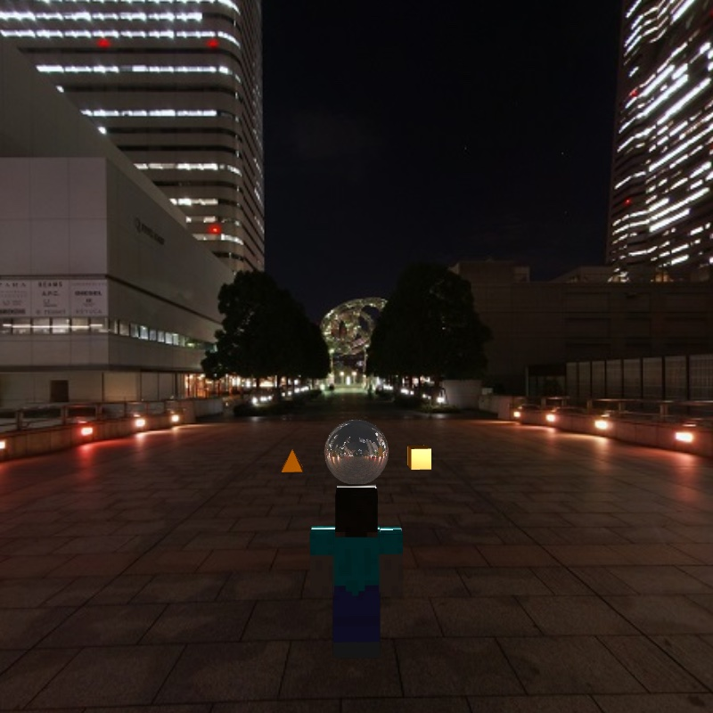
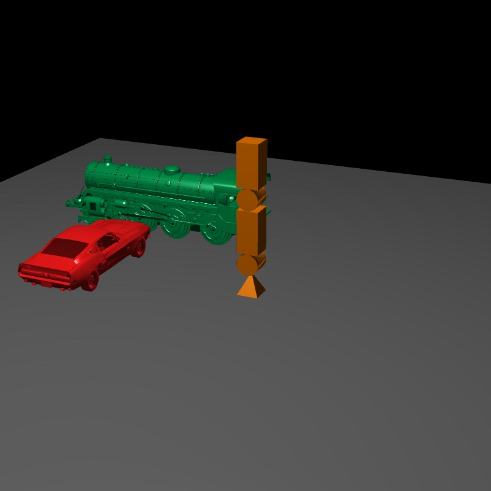

# 計算機圖學

用 **WebGL**(JavaScript)從零開始寫 3D 圖學程式:自己寫 vertex / fragment shader,處理矩陣變換、光照、貼圖與環境反射。四次作業逐步累積,最後整合成期末專題。

| 期末專題:第三人稱視角 | HW3:載入 3D 模型的場景 |
|---|---|
|  |  |

## 內容

| 資料夾 | 做了什麼 |
|---|---|
| [`HW1`](HW1) | **畫圖工具。** 按 `p`、`h`、`v`、`t`、`q` 切換點、水平線、垂直線、三角形、正方形,按 `r`、`g`、`b` 切換顏色,在畫面上點擊即可畫出。每種圖形只保留最後 5 個;同一種圖形用一次 `gl.drawArrays()` 畫完 |
| [`HW2`](HW2) | **階層式關節的機器人。** 由三角形、矩形、圓形組成,有三層關節與一支爪子,可用滑桿平移(X / Y)、縮放整個機器人,並單獨轉動每個關節。子關節會跟著父關節一起變換 |
| [`HW3`](HW3) | **3D 場景。** 載入兩個外部 OBJ 模型(蒸汽火車、福特野馬),加上一個用金字塔、圓柱、立方體組成的多關節角色,一起放在地板上。使用 Phong 光照(環境光 + 漫反射 + 鏡面反射)。滑鼠拖曳可旋轉整個場景、滾輪縮放,用滑桿移動角色 |
| [`HW4`](HW4) | **貼圖與環境。** 載入三個帶貼圖的 OBJ 模型(史帝夫、低多邊形狐狸、草地方塊),用 cube map 做天空盒背景,並以 Frame Buffer Object 做離屏渲染,把結果貼到場景中的畫面上。滑鼠拖曳轉動視角,`w` / `s` 沿視線前進、後退,下拉選單可切換 Normal / Depth |
| [`Final`](Final) | **期末專題:可操控角色的 3D 場景。** 見下方 |

## 期末專題

以史帝夫為玩家,在天空盒環境中移動:

- **視角:** 預設是第一人稱(相機跟著玩家),下拉選單可切換成第三人稱。滑鼠拖曳轉動視角,`w` 前進、`s` 後退。
- **光照:** 點光源與 Phong 光照,物體會有高光反射。
- **環境:** 以 cube map 當背景;有兩個 3D 物件(金字塔與方塊)持續繞著中央的圓球公轉。
- **進階功能:** 實作了 **cube map reflection** 與 **dynamic reflection**(圓球會即時反射周圍的物件,而不只是靜態的天空盒)。

## 如何執行

`HW1`、`HW2` 直接用瀏覽器開啟 `index.html` 即可。`HW3`、`HW4`、`Final` 會用 `fetch()` 載入模型與貼圖,瀏覽器不允許從 `file://` 讀取,所以需要一個本機伺服器:

```sh
cd Final                    # 或 HW3、HW4
python3 -m http.server 8000
```

再用瀏覽器開啟 <http://localhost:8000>。

## 備註

- 矩陣運算使用課程提供的函式庫 `cuon-matrix.js`;各次作業以課程提供的範本為基礎,再自行實作題目要求的功能。
- 3D 模型與天空盒貼圖為網路上取得的現成素材。
