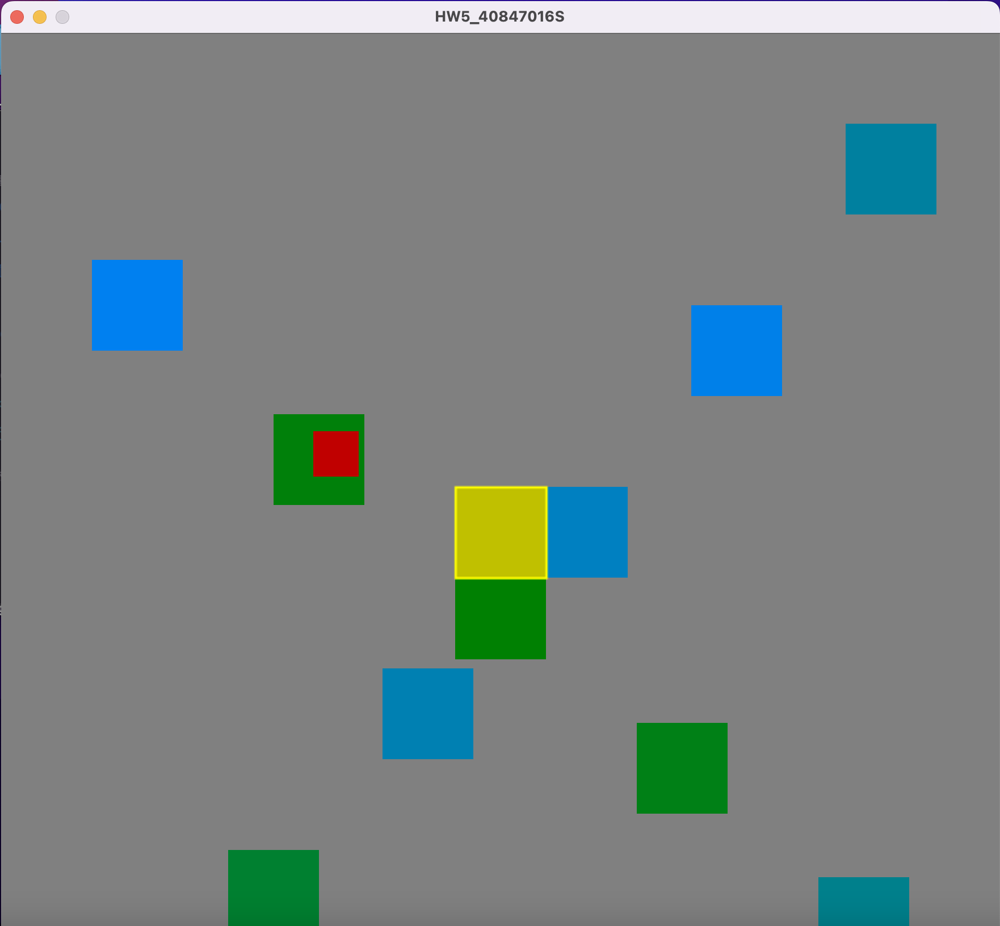
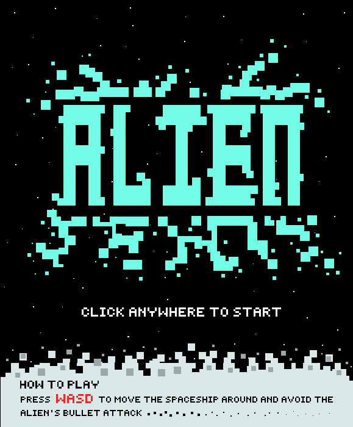

# 遊戲程式設計

用 **Processing** 開發 2D 遊戲:從向量繪圖、圖片動畫、音樂播放器、碰撞偵測,到串接雲端資料,最後分組完成期末專題。

| HW1:向量繪圖造型 | HW5:多物件碰撞偵測 | 期末專題:ALIEN |
|---|---|---|
|  |  |  |

## 內容

| 作業 | 主題 | 做了什麼 |
|---|---|---|
| [`hw1`](hw1) | 向量繪圖 | 用 `rect`、`ellipse` 等 2D 指令畫出夜景中的城市(四棟大樓、窗戶、月亮);加分項目:拖曳滑鼠畫出星星 |
| [`hw2`](hw2) | 圖片與自體旋轉 | 向量繪製的風車,扇葉會自動旋轉;太陽、月亮兩張去背圖片會跟著滑鼠移動,按滑鼠右鍵換圖 |
| [`hw3`](hw3) | 多媒體播放器 | 用 `minim` 播放音樂,面板有播放/暫停、靜音/取消靜音、停止、重新播放,按鈕以圖示呈現 |
| [`HW4_group`](HW4_group) | 場景與角色(團隊作業) | 以圖磚(tile)堆疊出星空背景,用鍵盤操控以 5 張影格輪播的動畫太空船;這是期末專題的前哨 |
| [`hw5`](hw5) | 多物件碰撞偵測 | 玩家跟著滑鼠移動,10 個障礙物以不同速度橫向、縱向移動;碰到障礙物玩家變紅(死亡),走到黃色復活點就會復活(變綠) |
| [`hw6`](hw6) | 網路資料存取 | 透過 Google 表單把資料寫入 Google 試算表,再讀回試算表的資料並顯示最新一筆 |
| [`final_project`](final_project) | 期末專題 | 分組製作的像素風射擊遊戲 **ALIEN**,見 [`final_project/readme.md`](final_project/readme.md) |

## 執行

1. 安裝 [Processing](https://processing.org/download)(Java 模式)。
2. 用 Processing 開啟資料夾內的 `.pde` 檔,按下執行。圖片、音樂等素材放在同資料夾的 `data/` 中,請保持原本的目錄結構。
3. 部分作業需要額外的函式庫(在 Processing 的 *Sketch → Import Library → Manage Libraries* 安裝):`hw3` 需要 **Minim**,`hw6` 需要 **HTTP Requests for Processing**。

`hw6` 會寫入我當時建立的 Google 表單。若要自己執行,請先建立自己的 Google 表單與試算表,再把程式中的網址與欄位代碼換成自己的。
